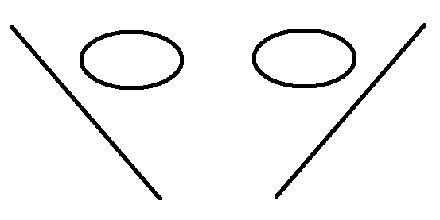

###Escuela Colombiana de Ingenieria
###Procesos de desarrollo de Software - PDSW


__Taller - diseño de pruebas: clases de equivalencia, condiciones de frontera, análisis de transiciones.__

__Parte I__

1. Descargue e importe el proyecto.
2. Revise cómo es la estructura de Maven para separar las pruebas de los demás artefactos del proyecto: src/main, src/test.
3. Ejecute la fase de pruebas del proyecto con el comando, y analice cómo son presentados los resultados.

	```
mvn test
	```
4. Implemente un caso de prueba para cada clase de equivalencia/condicion de frontera identificado. Recuerde usar la anotacion @Test y seguir la conveción de nombres: 

	```java
/**
* Pruebas clase de equivalencia XX: [Aquí la especificación de la clase de equivalencia]
**/
@Test
public void testClaseEquivalenciaXX(){
	...
}
	```

5. Una vez implementadas las pruebas, haga la implementación que ya hizo un 'programador poco confiable', en el archivo algoritmo-ProgramadorPocoConfiabe.txt.
6. Ejecute las pruebas. A partir de los resultados obtenidos, identifique los posibles problemas que tenga la implementación.
7. Hága el análisis de cobertura de sus pruebas, mediante el comando:
	
	```
mvn cobertura:cobertura
	```
	y posteriormente revisando el reporte en target/site/cobertura/. A partir de esto, identifique casos de prueba adicionales para que el cubrimiento de saltos mejore (ojalá al 100%).


###Parte II.
####Parte A.


En este ejercicio, va a agregar un par de requerimientos funcionales a una herramienta de dibujo tipo CAD, siguiendo un esquema TDD (Test-Driven development). En la evaluación se revisará que efectivamente se hayan hecho las pruebas antes de la implementación.

1. Clone el siguiente proyecto (use el siguiente comando, NO lo descargue directamente de la página!).

	```bash
git clone https://github.com/PDSW-ECI/GoF-Testing-BehavioralPatterns-CADTool.git
```

2. Importe el proyecto y revise su funcionalidad. Como observará, la opción 'espejo' (mirror) no está implementada aún. Esta función permite hacer una imágen espejo de lo que esté en la parte izquierda de la pantalla, al lado derecho de la misma (las figuras que estén en ambos lados a la vez, no se incluirán). Por ejemplo:
 
	

	Revise la especificación del método 'mirror' y a partir del mismo haga lo siguiente:
	
	* Defina las clases de equivalencia para las posibles entradas de este método. Ponga el detalle de estas clases, a manera de comentarios, en la clase de pruebas ControllerTest.
	* Seleccione un caso por cada clase de equivalencia e implemente las respectivas pruebas en ControllerTest.
	* Cuando haya hecho lo anterior, ejecute:
	
		```bash		
			git add .			
			git commit -m "primera versión de las pruebas"
			
		```		
	* Haga la implementación del método 'mirror', y apoyese en las pruebas (mvn test), para verificar la funcionalidad del mismo.
	* Una vez tenga la funcionalidad deseada, realice las pruebas de cubrimiento para rectificar que las pruebas están contemplando todos los caminos/condiciones del método implementado.
	* Una vez se tenga la funcionalidad implementada, haga un nuevo commit:
	
		```bash		
			git add .			
			git commit -m "funcionalidad mirror implementada"
			
		```		


####Parte B.

Otra funcionalidad faltante es la opción de 'deshacer' / 'rehacer'. Para esto, aplique el patrón Comando (ver referencia dada en la programación de lecturas).

Tenga en cuenta que para lograr esta funcionalidad se requiere:

1. Encapsular en 'Comandos' las funcionalidades de:

	* Dibujar una figura
	* Duplicar
	* Generar imágen espejo

2. Embeber en dichos comandos las respectivas operaciones inversas. Por ejemplo, el inverso de dibujar una figura es eliminarla, mientras que el inverso de duplicar, será borrar todas las figuras adicionales creadas.

3. Mantener, con un esquema de pilas, tanto la secuencia de comandos ejecutada, como la secuencia de comandos 'deshecha', de manera que las operaciones de 'deshacer' y 'rehacer' se hagan en un orden lógico.


